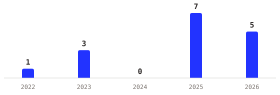

<h1 align="center">Hey, I'm Conor 👋</h1>

Host of <a href="https://chainofthought.show/?utm_source=github&utm_medium=referral&utm_campaign=repo-readme&utm_content=profile-readme">Chain of Thought</a> · <a href="https://conorbronsdon.com/consulting?utm_source=github&utm_medium=referral&utm_campaign=repo-readme&utm_content=profile-readme">Consulting</a> & Open Source Development · <a href="https://conorbronsdon.com/angel-investing?utm_source=github&utm_medium=referral&utm_campaign=repo-readme&utm_content=profile-readme">Angel Investor</a>
 

---

Led technical ecosystem at [Modular](https://www.modular.com/) ([acquired by Qualcomm](https://www.modular.com/blog/qualcomm-completes-acquisition-of-modular)), working on the [Mojo](https://github.com/modular/modular) programming language and [MAX](https://www.modular.com/max) inference platform. Before that, developer ecosystems & marketing at [Galileo](https://galileo.ai/) ([acquired by Cisco](https://blogs.cisco.com/news/cisco-announces-the-intent-to-acquire-galileo)) and [LinearB](https://linearb.io/), enterprise consulting at Microsoft, and a career in political organizing before any of it.

- 🎙️ 65+ episodes of [Chain of Thought](https://chainofthought.show/?utm_source=github&utm_medium=referral&utm_campaign=repo-readme&utm_content=profile-readme) shipped
- 💰 [Angel investor](https://conorbronsdon.com/angel-investing?utm_source=github&utm_medium=referral&utm_campaign=repo-readme&utm_content=profile-readme) in AI infrastructure, developer tools, and robotics
- 🎲 Avid Twilight Imperium and [Age of Empires II](https://github.com/conorbronsdon/aoe2-troop-calculator) player, former chess team nerd
- 📫 Best way to reach me: [LinkedIn](https://www.linkedin.com/in/conorbronsdon/)

### Chain of Thought

    

[Chain of Thought](https://chainofthought.show/?utm_source=github&utm_medium=referral&utm_campaign=repo-readme&utm_content=profile-readme) is a podcast and [newsletter](https://newsletter.chainofthought.show/?utm_source=github&utm_medium=referral&utm_campaign=repo-readme&utm_content=profile-readme) about AI infrastructure and the people building it. Guests include [Chip Huyen](https://www.chainofthought.show/podcast/5-practical-lessons-for-genai-evals-chip-huyen-and-vivienne-zhang/?utm_source=github&utm_medium=referral&utm_campaign=repo-readme&utm_content=profile-readme), [Logan Kilpatrick](https://www.chainofthought.show/podcast/12-the-making-of-gemini-2-0-deepminds-approach-to-ai-development-and-deployment-logan-kilpatr/?utm_source=github&utm_medium=referral&utm_campaign=repo-readme&utm_content=profile-readme) of [Google DeepMind](https://newsletter.chainofthought.show/p/chain-of-thought-the-future-of-ai?utm_source=github&utm_medium=referral&utm_campaign=repo-readme&utm_content=profile-readme), plus leaders and founders from [NVIDIA](https://www.chainofthought.show/podcast/5-practical-lessons-for-genai-evals-chip-huyen-and-vivienne-zhang/?utm_source=github&utm_medium=referral&utm_campaign=repo-readme&utm_content=profile-readme), [AMD](https://www.chainofthought.show/podcast/28-amds-challenge-to-nvidia-the-open-ecosystem-bet-anush-elangovan-and-sharon-zhou/?utm_source=github&utm_medium=referral&utm_campaign=repo-readme&utm_content=profile-readme), [Databricks](https://www.chainofthought.show/podcast/22-ais-two-extremes-foundations-and-the-frontier-databricks-denny-lee/?utm_source=github&utm_medium=referral&utm_campaign=repo-readme&utm_content=profile-readme), [Poolside](https://www.chainofthought.show/podcast/23-first-code-then-agi-softwares-event-horizon-with-poolside-founders-jason-warner-and-eiso-k/?utm_source=github&utm_medium=referral&utm_campaign=repo-readme&utm_content=profile-readme), [Liquid AI](https://www.chainofthought.show/podcast/43-beyond-transformers-how-liquid-ai-is-rethinking-llm-architecture-maxime-labonne/?utm_source=github&utm_medium=referral&utm_campaign=repo-readme&utm_content=profile-readme), [Fireworks](https://www.chainofthought.show/podcast/42-architecting-ai-agents-the-shift-from-models-to-systems-aishwarya-srinivasan/?utm_source=github&utm_medium=referral&utm_campaign=repo-readme&utm_content=profile-readme), [Vercel](https://www.chainofthought.show/podcast/39-vercels-playbook-for-ai-agents-from-vibe-check-to-production-malte-ubl/?utm_source=github&utm_medium=referral&utm_campaign=repo-readme&utm_content=profile-readme), and many others.

#### Newsletter: 

- [Block Cut 4,000 Jobs and Blamed AI. The Truth is More Complicated.](https://newsletter.chainofthought.show/p/block-cut-4000-jobs-and-blamed-ai?utm_source=github&utm_medium=referral&utm_campaign=repo-readme&utm_content=profile-readme)
- [He Built an AI Coworker to Run 90% of his Day](https://newsletter.chainofthought.show/p/he-named-his-ai-coworker-marvin-it?utm_source=github&utm_medium=referral&utm_campaign=repo-readme&utm_content=profile-readme)
- [What Atlassian's $1B DX Acquisition Means for the Developer Productivity Market](https://newsletter.chainofthought.show/p/what-dxs-1b-acquisition-means-for?utm_source=github&utm_medium=referral&utm_campaign=repo-readme&utm_content=profile-readme)
- [The Rise of Tireless Digital Employees](https://newsletter.chainofthought.show/p/the-rise-of-tireless-digital-employees?utm_source=github&utm_medium=referral&utm_campaign=repo-readme&utm_content=profile-readme)
- [2024 Is the Year GenAI Code Hits Adolescence](https://devinterrupted.substack.com/p/2024-is-the-year-genai-code-hits)
- [The Problem with Perfectionism](https://newsletter.chainofthought.show/p/the-problem-with-perfectionism?utm_source=github&utm_medium=referral&utm_campaign=repo-readme&utm_content=profile-readme)

### Open projects

Priority projects by category. [Full list with stars and forks →](https://conorbronsdon.com/builds?utm_source=github&utm_medium=referral&utm_campaign=repo-readme&utm_content=profile-readme)

#### Agent skills & context · [all →](https://conorbronsdon.com/builds?utm_source=github&utm_medium=referral&utm_campaign=repo-readme&utm_content=profile-readme#agent-skills)

| | Repo | What it does | |
|---|------|-------------|---|
| 🛠️ | [agent-skills](https://github.com/conorbronsdon/agent-skills) | Nine production-tested agent skills for Claude Code, Codex, Cursor, and OpenCode: session memory, multi-agent code review, eval integrity, SSOT checks, drift reconciliation, and worktree recovery. Ships with a drop-in installer. It's the incubator the standalone skill repos graduate from |  |
| 🧩 | [claude-context-os](https://github.com/conorbronsdon/claude-context-os) | An operating system for your Claude context: versioned files, self-curating memory, /start→/end loop |  |
| 🧠 | [agent-memory-kit](https://github.com/conorbronsdon/agent-memory-kit) | The curation loop for agent memory: capture, recall, and a read-only curator that finds rot and contradictions before your agent is confidently wrong |  |

#### MCP servers · [all →](https://conorbronsdon.com/builds?utm_source=github&utm_medium=referral&utm_campaign=repo-readme&utm_content=profile-readme#mcp-servers)

| | Repo | What it does | |
|---|------|-------------|---|
| 📧 | [gws-mcp-server](https://github.com/conorbronsdon/gws-mcp-server) | Google Workspace for AI agents: Gmail, Calendar, Drive, Sheets, Docs, and Tasks as 39 curated MCP tools on the official gws CLI |  |
| 📰 | [substack-mcp](https://github.com/conorbronsdon/substack-mcp) | MCP server for Substack: posts are draft-only by design, short-form Notes publish immediately |  |
| 🎛️ | [Transistor-MCP](https://github.com/conorbronsdon/Transistor-MCP) | MCP server for the Transistor.fm API: episodes, analytics, transcripts, and webhooks. Maintained fork of gxjansen/Transistor-MCP. |  |

#### Writing & creator tools · [all →](https://conorbronsdon.com/builds?utm_source=github&utm_medium=referral&utm_campaign=repo-readme&utm_content=profile-readme#creator-tools)

| | Repo | What it does | |
|---|------|-------------|---|
| ✍️ | [avoid-ai-writing](https://github.com/conorbronsdon/avoid-ai-writing) | Open-source AI writing detector & rewriter for Claude Code, Cowork, OpenClaw & Cursor. 53 pattern categories, 109-entry replacement table, two-pass rewrite, zero-dep detector engine. |  |
| 🎯 | [ai-tools-for-creators](https://github.com/conorbronsdon/ai-tools-for-creators) | Curated AI skills, MCP servers, and workflow tools for creators |  |

#### Mojo libraries

Eleven pure-Mojo libraries mirroring Python stdlib APIs, covering feeds, XML, Markdown, HTML, captions, Unicode, diff, templates, tar, Redis, URLs. Each anchored to an external ground truth: official spec suites, byte-for-byte Python parity, or real-world corpora. [The suite →](https://conorbronsdon.com/builds?utm_source=github&utm_medium=referral&utm_campaign=repo-readme&utm_content=profile-readme#mojo-libraries)

Also on [/builds](https://conorbronsdon.com/builds?utm_source=github&utm_medium=referral&utm_campaign=repo-readme&utm_content=profile-readme): eval-integrity, ssot-check, agent-workspace, agent-skill-builder, demo-gif-skill, podcastindex-mcp, op3-mcp, podcast-benchmark, ai-learning-resources, and the hobby projects.

*These are independent personal projects, not affiliated with, sponsored by, or endorsed by any company. All views expressed are my own.*

### Angel portfolio

I write $1–10K checks into early-stage companies, mostly AI infrastructure, developer tools, and robotics. Fifteen checks since 2022, including Substack, Shield, Zaapi, Swytchcode, Haply Robotics, and Ansel.

<picture>
  <source media="(prefers-color-scheme: dark)" srcset="assets/angel-checks-dark.svg">
  
</picture>

**[Full portfolio, thesis, and advisory roles →](https://conorbronsdon.com/angel-investing?utm_source=github&utm_medium=referral&utm_campaign=repo-readme&utm_content=profile-readme)**

I also maintain [ai-angels](https://github.com/conorbronsdon/ai-angels), a community-maintained list of active angel investors in AI. Every entry is publicly verified, with a last-verified date and source on each row.

### How'd you start coding?

My first time in a command line was part of a 2007 era high-school project refurbishing PCs for computer labs throughout Latin America, which rapidly evolved into making websites for old Runescape clans.

### Connect with me

